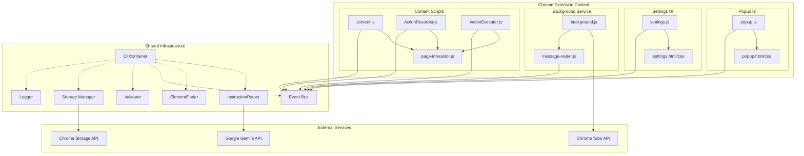
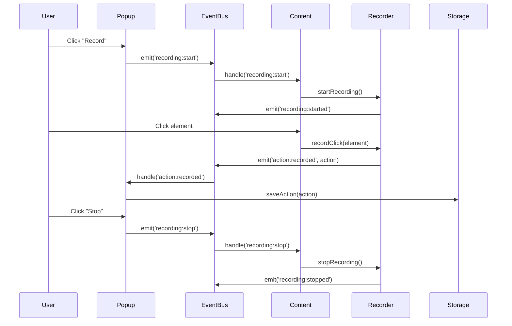
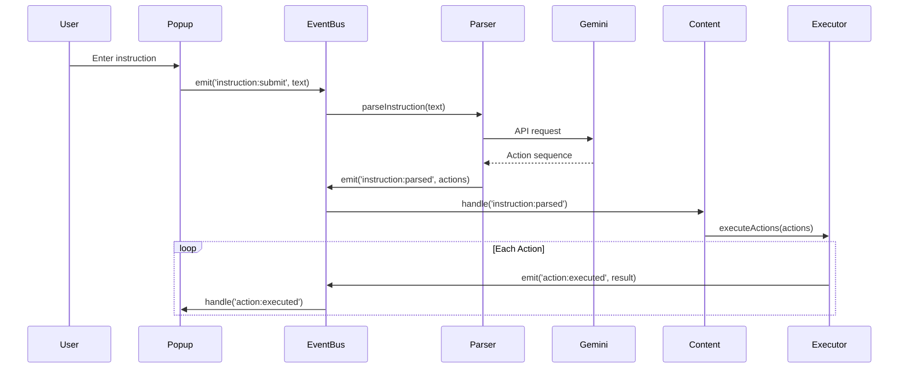
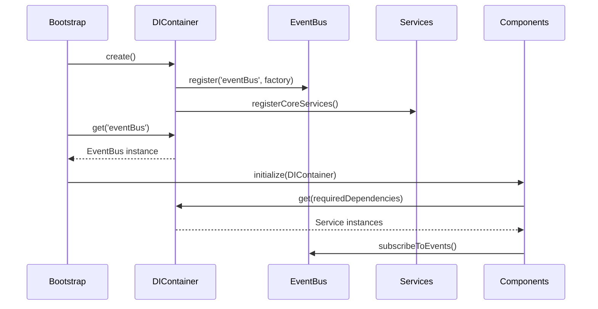

# AI-Autoclicker Architecture

## Overview

AI-Autoclicker is a Chrome extension that automates web actions through manual recording and AI-powered instruction processing. The architecture is designed around modularity, dependency injection, and event-driven communication to ensure maintainability and testability.

## Current vs Target Architecture

### Current State (Flat Structure)
The extension currently uses a flat file structure for stability during migration:
```
src/
├── [all files at root level]
├── manifest.json
├── popup.html/css/js
├── content.js/css
├── background.js
├── settings.html/css/js
└── [module files...]
```

### Target Modular Structure
The planned architecture organizes code by responsibility and feature:

```
src/
├── common/                     # Shared utilities and core infrastructure
│   ├── constants.js           # Global constants and enums
│   ├── logger.js              # Logging system
│   ├── validator.js           # Input validation
│   ├── storage.js             # Storage abstraction layer
│   ├── helpers.js             # Utility functions
│   ├── events.js              # Event bus implementation
│   └── di-container.js        # Dependency injection container
├── ai/                         # AI and instruction processing
│   ├── InstructionParser.js   # Gemini AI integration
│   ├── ElementFinder.js       # Advanced element location
│   └── ai-services.js         # AI-specific services
├── popup/                      # Extension popup interface
│   ├── popup.html             # Popup UI structure
│   ├── popup.css              # Popup styling
│   ├── popup.js               # Popup controller
│   └── components/            # Reusable UI components
├── settings/                   # Extension settings and configuration
│   ├── settings.html          # Settings UI
│   ├── settings.css           # Settings styling
│   ├── settings.js            # Settings controller
│   └── config-manager.js      # Configuration management
├── background/                 # Service worker and background tasks
│   ├── background.js          # Service worker entry point
│   ├── message-router.js      # Chrome message handling
│   └── background-services.js # Background-specific services
├── content/                    # Content scripts and page interaction
│   ├── content.js             # Main content script controller
│   ├── content.css            # Content script styles
│   ├── ActionRecorder.js      # Action recording logic
│   ├── ActionExecutor.js      # Action execution engine
│   └── page-interactor.js     # Page interaction utilities
└── assets/                     # Static resources
    ├── images/                # Icons and images
    └── fonts/                 # Custom fonts (if needed)
```

## System Architecture Diagram



## Component Responsibilities

### Common Layer (`common/`)

#### DI Container
- Manages all service dependencies
- Provides singleton and factory patterns
- Enables easy testing and mocking

#### Event Bus
- Centralized communication hub
- Decouples components from each other
- Supports pub/sub patterns

#### Storage Manager
- Abstracts Chrome storage APIs
- Provides versioned storage schemas
- Handles data migration

#### Logger
- Structured logging with levels
- Context-aware logging
- Performance monitoring

### AI Layer (`ai/`)

#### Instruction Parser
- Integrates with Google Gemini API
- Converts natural language to actions
- Handles API errors and rate limiting

#### Element Finder
- Advanced element location strategies
- Robust selector generation
- Handles dynamic content

### UI Layer (`popup/`, `settings/`)

#### Popup Controller
- Manages popup state and UI
- Handles user interactions
- Coordinates with content scripts

#### Settings Manager
- Configuration persistence
- Settings validation
- User preference management

### Background Layer (`background/`)

#### Service Worker
- Extension lifecycle management
- Cross-tab communication
- Background task coordination

#### Message Router
- Chrome message passing
- Request/response handling
- Security validation

### Content Layer (`content/`)

#### Content Controller
- Page context management
- Component coordination
- User interaction handling

#### Action Recorder
- Event interception
- Action sequence building
- Recording state management

#### Action Executor
- Action playback engine
- Error handling and recovery
- Execution monitoring

## Communication Flows

### 1. Action Recording Flow



### 2. AI-Powered Action Flow



### 3. Dependency Injection Bootstrap



## Event Bus Schema

### Core Events

#### Recording Events
- `recording:start` - Start recording actions
- `recording:stop` - Stop recording actions
- `recording:started` - Recording has begun
- `recording:stopped` - Recording has ended

#### Action Events
- `action:recorded` - New action recorded
- `action:executed` - Action execution completed
- `action:failed` - Action execution failed
- `action:retry` - Retry failed action

#### AI Events
- `instruction:submit` - User submitted instruction
- `instruction:parsed` - AI parsed instruction
- `instruction:error` - AI processing failed

#### UI Events
- `ui:action-added` - Action added to UI list
- `ui:action-removed` - Action removed from UI
- `ui:state-changed` - UI state updated

#### Storage Events
- `storage:actions-saved` - Actions saved to storage
- `storage:settings-updated` - Settings changed
- `storage:migration-needed` - Data migration required

### Event Payload Structure

```javascript
// Example: action:recorded
{
  type: 'action:recorded',
  timestamp: 1699450000000,
  payload: {
    action: {
      type: 'click',
      target: 'Login button',
      selector: '.btn-login',
      value: null,
      timestamp: 1699450000000
    },
    source: 'user-recording',
    context: {
      url: 'https://example.com',
      title: 'Login Page'
    }
  }
}
```

## Dependency Injection Configuration

### Service Registration

```javascript
// di-container.js
class DIContainer {
  constructor() {
    this.services = new Map();
    this.singletons = new Map();
  }

  registerServices() {
    // Core services (singletons)
    this.register('eventBus', () => new EventEmitter(), { singleton: true });
    this.register('logger', () => new Logger(), { singleton: true });
    this.register('storage', () => new StorageManager(), { singleton: true });
    this.register('validator', () => new Validator(), { singleton: true });
    
    // AI services
    this.register('elementFinder', (container) => 
      new ElementFinder(container.get('logger')), { singleton: true });
    this.register('instructionParser', (container) => 
      new InstructionParser(container.get('logger')), { singleton: true });
    
    // Action services (factory pattern for new instances)
    this.register('actionRecorder', (container) => 
      new ActionRecorder(
        container.get('elementFinder'),
        container.get('eventBus'),
        container.get('logger')
      ));
    
    this.register('actionExecutor', (container) => 
      new ActionExecutor(
        container.get('elementFinder'),
        container.get('eventBus'),
        container.get('logger')
      ));
  }
}
```

### Component Bootstrap

```javascript
// content.js bootstrap
async function initializeContentScript() {
  const container = new DIContainer();
  container.registerServices();
  
  const eventBus = container.get('eventBus');
  const recorder = container.get('actionRecorder');
  const executor = container.get('actionExecutor');
  
  // Setup event listeners
  eventBus.on('recording:start', () => recorder.start());
  eventBus.on('recording:stop', () => recorder.stop());
  eventBus.on('actions:execute', ({ actions, speed }) => 
    executor.execute(actions, speed));
  
  // Initialize content script functionality
  setupMessageHandling(eventBus);
  setupDOMEventListeners(recorder);
  
  return { container, eventBus, recorder, executor };
}
```

## Security Architecture

### Content Security Policy (CSP)
- No inline scripts or event handlers
- All external resources have proper integrity hashes
- Minimal permissions requested

### Input Validation
- All user inputs validated through `validator.js`
- XSS prevention through proper escaping
- SQL injection prevention through parameterized queries

### Permission Model
- `activeTab` - Only access current active tab
- `scripting` - Inject content scripts when needed
- `storage` - Local data persistence only
- `host_permissions` - All URLs for content script injection

## Performance Considerations

### Lazy Loading
- Services loaded on-demand
- Content scripts injected only when needed
- AI API calls debounced and cached

### Memory Management
- Event listeners properly cleaned up
- Service instances managed by DI container
- Storage quotas monitored and respected

### Optimization Strategies
- Element selector caching
- Action batching for improved performance
- Background processing for heavy computations

## Testing Architecture

### Unit Testing
- Each service tested in isolation
- DI container enables easy mocking
- Event bus allows testing event flows

### Integration Testing
- Component interaction tested
- Chrome extension APIs mocked
- End-to-end user flows validated

### Test Utilities
```javascript
// test-utils.js
class TestDIContainer extends DIContainer {
  constructor() {
    super();
    this.registerMockServices();
  }
  
  registerMockServices() {
    this.register('eventBus', () => new MockEventBus());
    this.register('storage', () => new MockStorage());
    this.register('logger', () => new MockLogger());
  }
}
```

## Migration Strategy

### Phase 1: Infrastructure (Current)
- [x] Flatten file structure for stability
- [x] Implement basic event bus
- [x] Create DI container foundation

### Phase 2: Modular Migration
- [ ] Organize files into target structure
- [ ] Update import statements
- [ ] Migrate to DI pattern

### Phase 3: Advanced Features
- [ ] Implement advanced UI components
- [ ] Add comprehensive testing
- [ ] Performance optimization

### Phase 4: Production Readiness
- [ ] Documentation completion
- [ ] Security audit
- [ ] Performance benchmarking

## Future Extensibility

The modular architecture enables easy addition of:

- **New Action Types**: Add to `ActionExecutor` and register in DI
- **AI Providers**: Implement new `InstructionParser` variants
- **UI Themes**: Extend popup with theme system
- **Cloud Sync**: Add storage provider implementations
- **Advanced Recording**: Implement new recording strategies

The event bus and DI container ensure that new features can be added without modifying existing code, following the Open/Closed Principle.