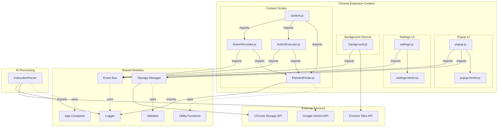
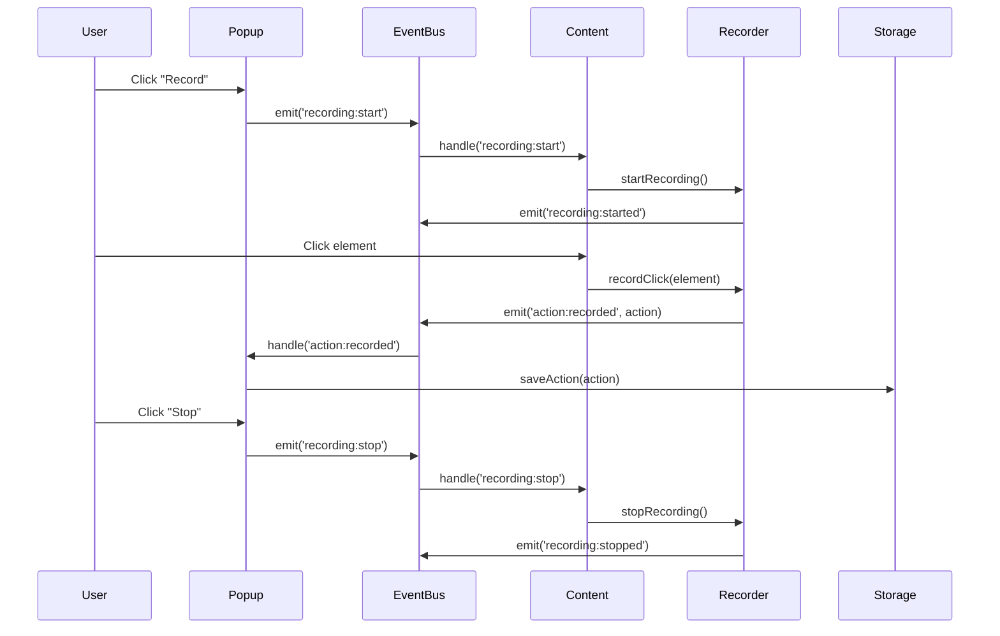
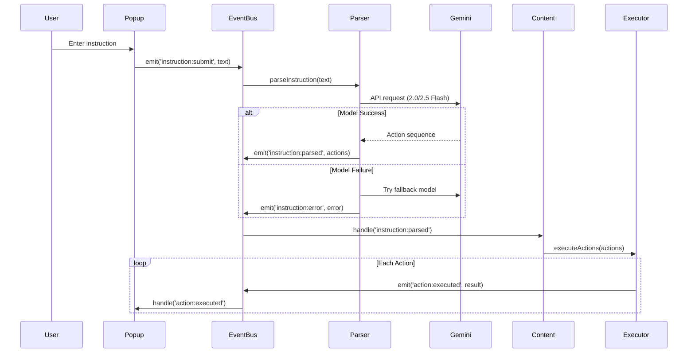
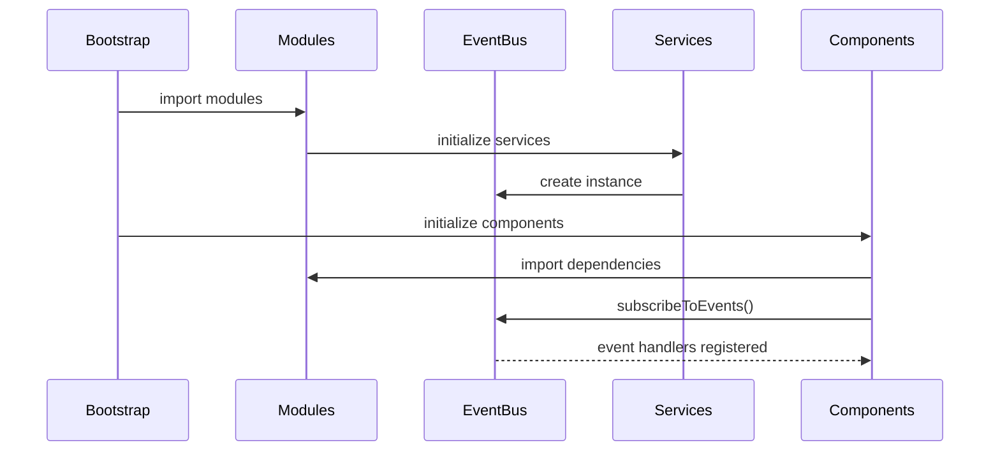

# AI-Autoclicker Architecture

## Overview

AI-Autoclicker is a Chrome extension that automates web actions through manual recording and AI-powered instruction processing. The architecture is designed around ES6 modules, Rollup bundling, and event-driven communication to ensure maintainability and testability.

## Current Architecture

The extension now uses a fully modular ES6 structure with Rollup bundling:

### Directory Structure
```
src/
├── common/                     # Shared utilities and core infrastructure
│   ├── constants.js           # Global constants and enums
│   ├── logger.js              # Logging system
│   ├── validator.js           # Input validation
│   ├── storage.js             # Storage abstraction layer
│   ├── helpers.js             # Utility functions
│   └── events.js              # Event bus implementation
├── ai/                         # AI and instruction processing
│   └── InstructionParser.js   # Gemini AI integration
├── popup/                      # Extension popup interface
│   ├── index.html             # Popup UI structure
│   ├── index.js               # Popup controller
│   └── popup.css              # Popup styling
├── settings/                   # Extension settings and configuration
│   ├── index.html             # Settings UI
│   ├── index.js               # Settings controller
│   └── settings.css           # Settings styling
├── background/                 # Service worker and background tasks
│   └── index.js              # Service worker entry point
├── content/                    # Content scripts and page interaction
│   ├── index.js              # Main content script controller
│   ├── content.css           # Content script styles
│   ├── recorder/
│   │   └── ActionRecorder.js  # Action recording logic
│   ├── executor/
│   │   └── ActionExecutor.js  # Action execution engine
│   └── finder/
│       └── ElementFinder.js   # Smart element selection
├── images/                     # Static resources
│   ├── icon16.png
│   ├── icon48.png
│   └── icon128.png
├── manifest.json               # Extension configuration
├── rollup.config.js           # Rollup bundler configuration
└── __tests__/                 # Unit and integration tests
```

### Bundle Structure
The Rollup bundler creates 4 optimized bundles:

```javascript
// Bundle 1: Content Script
src/content/index.js → deploy/content.js
// Includes: ElementFinder, ActionRecorder, ActionExecutor, content utilities

// Bundle 2: Popup UI  
src/popup/index.js → deploy/popup.js
// Includes: popup logic, UI components, event handlers

// Bundle 3: Settings Page
src/settings/index.js → deploy/settings.js
// Includes: settings management, configuration UI

// Bundle 4: Service Worker
src/background/index.js → deploy/background.js
// Includes: background tasks, message routing, extension lifecycle
```

## System Architecture Diagram



## Component Responsibilities

### Common Layer (`common/`)

#### Event Bus
- Centralized communication hub
- Decouples components from each other
- Supports pub/sub patterns
- Event-driven architecture

#### Storage Manager
- Abstracts Chrome storage APIs
- Provides versioned storage schemas
- Handles data migration
- Local and sync storage support

#### Logger
- Structured logging with levels
- Context-aware logging
- Performance monitoring
- Chrome console integration

#### Validator
- Input validation and sanitization
- Action validation
- XSS prevention
- Schema validation

#### Constants
- Application-wide constants
- Action types and enums
- Configuration values
- API endpoints

### AI Layer (`ai/`)

#### Instruction Parser
- Integrates with Google Gemini API (2.0/2.5 Flash)
- Converts natural language to actions
- Handles API errors and rate limiting
- Fallback chain for model availability
- Error handling in multiple languages

### UI Layer (`popup/`, `settings/`)

#### Popup Controller
- Manages popup state and UI
- Handles user interactions
- Coordinates with content scripts
- Event-driven updates

#### Settings Manager
- Configuration persistence
- Settings validation
- User preference management
- API key management

### Background Layer (`background/`)

#### Service Worker
- Extension lifecycle management
- Cross-tab communication
- Background task coordination
- Message routing
- Extension event handling

### Content Layer (`content/`)

#### Content Controller
- Page context management
- Component coordination
- User interaction handling
- DOM event management

#### Action Recorder
- Event interception
- Action sequence building
- Recording state management
- Visual feedback

#### Action Executor
- Action playback engine
- Error handling and recovery
- Execution monitoring
- Speed control

#### Element Finder
- Advanced element location strategies
- Robust selector generation
- Handles dynamic content
- Multiple search strategies
- IFRAME support

## Communication Flows

### 1. Action Recording Flow



### 2. AI-Powered Action Flow



### 3. ES6 Module Bootstrap



## Event Bus Schema

### Core Events

#### Recording Events
- `recording:start` - Start recording actions
- `recording:stop` - Stop recording actions
- `recording:started` - Recording has begun
- `recording:stopped` - Recording has ended

#### Action Events
- `action:recorded` - New action recorded
- `action:executed` - Action execution completed
- `action:failed` - Action execution failed
- `action:retry` - Retry failed action

#### AI Events
- `instruction:submit` - User submitted instruction
- `instruction:parsed` - AI parsed instruction
- `instruction:error` - AI processing failed

#### UI Events
- `ui:action-added` - Action added to UI list
- `ui:action-removed` - Action removed from UI
- `ui:state-changed` - UI state updated

#### Storage Events
- `storage:actions-saved` - Actions saved to storage
- `storage:settings-updated` - Settings changed
- `storage:migration-needed` - Data migration required

### Event Payload Structure

```javascript
// Example: action:recorded
{
  type: 'action:recorded',
  timestamp: 1699450000000,
  payload: {
    action: {
      type: 'click',
      target: 'Login button',
      selector: '.btn-login',
      value: null,
      timestamp: 1699450000000
    },
    source: 'user-recording',
    context: {
      url: 'https://example.com',
      title: 'Login Page'
    }
  }
}
```

## ES6 Module Examples

### Module Import Pattern

```javascript
// content/index.js - Main entry point
import { EventBus } from '../common/events.js';
import { Logger } from '../common/logger.js';
import { StorageManager } from '../common/storage.js';
import ActionRecorder from './recorder/ActionRecorder.js';
import ActionExecutor from './executor/ActionExecutor.js';
import ElementFinder from './finder/ElementFinder.js';

class ContentController {
  constructor() {
    this.eventBus = new EventBus();
    this.logger = new Logger('Content');
    this.storage = new StorageManager();
    this.recorder = new ActionRecorder(this.eventBus, this.logger);
    this.executor = new ActionExecutor(this.eventBus, this.logger);
    this.finder = new ElementFinder(this.logger);
  }

  async initialize() {
    // Setup event listeners
    this.eventBus.on('recording:start', () => this.recorder.start());
    this.eventBus.on('recording:stop', () => this.recorder.stop());
    this.eventBus.on('actions:execute', ({ actions, speed }) => 
      this.executor.execute(actions, speed));
    
    // Initialize content script functionality
    this.setupMessageHandling();
    this.setupDOMEventListeners();
    
    this.logger.info('Content script initialized');
  }
}

// Initialize when content script loads
const controller = new ContentController();
controller.initialize();
```

### Shared Module Pattern

```javascript
// common/events.js - Event bus implementation
export class EventBus {
  constructor() {
    this.events = new Map();
  }

  on(event, callback) {
    if (!this.events.has(event)) {
      this.events.set(event, []);
    }
    this.events.get(event).push(callback);
  }

  emit(event, data) {
    if (this.events.has(event)) {
      this.events.get(event).forEach(callback => callback(data));
    }
  }

  off(event, callback) {
    if (this.events.has(event)) {
      const callbacks = this.events.get(event);
      const index = callbacks.indexOf(callback);
      if (index > -1) {
        callbacks.splice(index, 1);
      }
    }
  }
}

// Export singleton instance for shared use
export const globalEventBus = new EventBus();
export default globalEventBus;
```

## Security Architecture

### Content Security Policy (CSP)
- No inline scripts or event handlers
- All external resources have proper integrity hashes
- Minimal permissions requested
- ES6 modules with proper integrity

### Input Validation
- All user inputs validated through `validator.js`
- XSS prevention through proper escaping
- Selector validation and sanitization
- Action schema validation

### Permission Model
- `activeTab` - Only access current active tab
- `scripting` - Inject content scripts when needed
- `storage` - Local data persistence only
- `host_permissions` - All URLs for content script injection

### Data Protection
- API keys stored securely in Chrome storage
- No sensitive data in logs
- Input sanitization before processing
- Secure communication between contexts

## Performance Considerations

### Bundle Optimization
- Tree-shaking removes unused code
- Minification reduces bundle size
- Source maps for development debugging
- 4 optimized bundles vs 300+ files

### Lazy Loading
- Services loaded on-demand
- Content scripts injected only when needed
- AI API calls debounced and cached

### Memory Management
- Event listeners properly cleaned up
- Module scoping prevents memory leaks
- Storage quotas monitored and respected

### Optimization Strategies
- Element selector caching
- Action batching for improved performance
- Background processing for heavy computations
- Rollup code splitting

## Build Pipeline

### Rollup Configuration
```javascript
// rollup.config.js
export default [
  {
    input: 'src/content/index.js',
    output: {
      file: 'deploy/content.js',
      format: 'es',
      sourcemap: isDev,
    },
    plugins: [resolve(), replace({...}), ...(isDev ? [] : [terser()])]
  },
  // Similar configs for popup, settings, background
];
```

### Build Process
1. **Clean deploy/** directory**
2. **Run Rollup bundling** - 4 parallel builds
3. **Copy static files** - HTML, CSS, images, manifest
4. **Verify build** - Check all required files exist
5. **Report bundle sizes** - Monitor optimization

## Testing Architecture

### Unit Testing
- Each service tested in isolation
- ES6 modules enable easy mocking
- Event bus allows testing event flows
- Jest with Chrome API mocks

### Integration Testing
- Component interaction tested
- Chrome extension APIs mocked
- End-to-end user flows validated
- JSDOM for DOM testing

### Test Structure
```
tests/
├── content/           # Content script tests
├── popup/            # Popup UI tests
├── settings/         # Settings tests
├── background/       # Background service tests
├── common/           # Utility tests
└── integration/      # End-to-end tests
```

### Coverage Strategy
- **Target:** 65-70% overall coverage
- **Critical paths:** 90%+ coverage
- **Utilities:** 80%+ coverage
- **UI components:** 75%+ coverage

## Future Extensibility

The modular architecture enables easy addition of:

- **New Action Types**: Add to `ActionExecutor` and import where needed
- **AI Providers**: Implement new `InstructionParser` variants
- **UI Themes**: Extend popup with theme system
- **Cloud Sync**: Add storage provider implementations
- **Advanced Recording**: Implement new recording strategies

The ES6 module system and event bus ensure that new features can be added without modifying existing code, following the Open/Closed Principle.

## Cross-References

- **[Installation Guide](docs/INSTALLATION.md)** - Step-by-step setup
- **[Development Setup](docs/DEVELOPMENT.md)** - Development workflows
- **[Testing Documentation](docs/TESTING.md)** - Testing with Jest
- **[Contributing Guide](CONTRIBUTING.md)** - How to contribute
- **[Gemini API Migration](docs/GEMINI-API-MIGRATION.md)** - API integration details
- **[Final Readiness Check](docs/FINAL-READINESS-CHECK.md)** - Release checklist

---

## Architecture Summary

AI-Autoclicker v2.0 represents a complete modernization with:

✅ **ES6 Modules** - Clean import/export syntax  
✅ **Rollup Bundling** - Optimized production builds  
✅ **Event-Driven Architecture** - Decoupled components  
✅ **Comprehensive Testing** - Jest with Chrome API mocks  
✅ **Modern Build Pipeline** - Automated bundling and verification  
✅ **Security-First Design** - CSP compliance and validation  
✅ **Performance Optimized** - Tree-shaking and minification  

This architecture ensures maintainability, testability, and performance for future development.